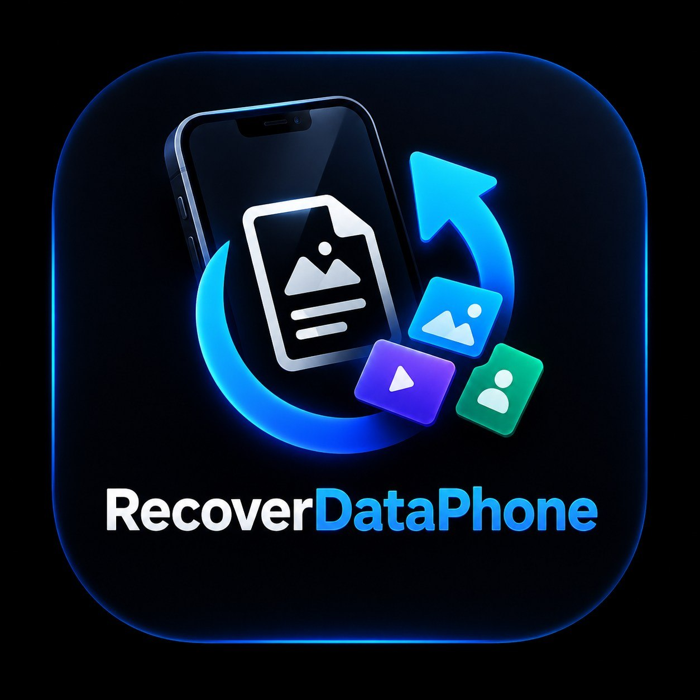

<!-- ============================================================ -->
<!-- Logo & Title                                                 -->
<!-- ============================================================ -->
<div align="center">

<!-- ضع شعارك هنا (استبدل logo.png) -->


# RecoverDataPhone

### استرجاع البيانات من الهواتف ذات الشاشات المكسورة

[](https://github.com/YOUR_USERNAME/RecoverDataPhone/releases)
[](LICENSE)
[](https://developer.android.com)
[](#-التقنيات-المستخدمة)

</div>

---
<!-- ============================================================ -->
<!-- Description                                                  -->
<!-- ============================================================ -->
## 📖 نظرة عامة

**RecoverDataPhone** هو نظام متكامل لاسترجاع البيانات من الهواتف ذات الشاشات المكسورة أو التالفة. يتكوّن من:

- 📱 **تطبيق Android** — يُثبَّت على الهاتف المُتضرر.
- 🖥️ **سيرفر Python** — يستقبل البيانات ويتحكم بالهاتف عن بُعد.
- 💻 **واجهة طرفية** — للتحكم الكامل من أي جهاز.

> **⚠️ ملاحظة قانونية**: هذا النظام مُخصَّص **فقط** لاسترجاع بيانات مالك الجهاز. يُمنع استخدامه لأي غرض غير قانوني.

---

<!-- ============================================================ -->
<!-- Features                                                     -->
<!-- ============================================================ -->
## ✨ الميزات

### 📦 استرجاع البيانات
- ✅ سحب الصور من الجهاز (بأحجام كبيرة)
- ✅ سحب الفيديوهات (حتى 2 GB لكل ملف)
- ✅ سحب ملفات محددة بمسارها
- ✅ عرض محتوى المجلدات
- ✅ نقل آمن كأجزاء (Chunks) مع Base64

### 🎮 التحكم عن بُعد
- ✅ تنفيذ اللمس (نقرة + ضغط طويل)
- ✅ السحب (Swipe) بين الشاشات
- ✅ كتابة نصوص عن بُعد
- ✅ التمرير التلقائي
- ✅ النقر على عناصر بنصها
- ✅ قراءة شجرة الواجهة (UI Tree)
- ✅ فتح التطبيقات والإعدادات
- ✅ الموافقة التلقائية على الحوارات

### 🔒 الأمان
- ✅ تشفير AES-256-GCM للرسائل
- ✅ تبادل مفاتيح RSA-2048-OAEP
- ✅ مصادقة بمفتاح ترخيص
- ✅ ربط الترخيص بالجهاز
- ✅ Rate Limiting لكل عميل
- ✅ سجل تدقيق (Audit Log) شامل

### 🌐 الاستمرارية
- ✅ Foreground Service دائم
- ✅ إعادة اتصال تلقائي (Exponential Backoff)
- ✅ إعادة التشغيل بعد إعادة تشغيل الهاتف
- ✅ WakeLock لمنع النوم العميق

---

<!-- ============================================================ -->
<!-- Architecture                                                 -->
<!-- ============================================================ -->
## 🏗️ المعمارية
┌──────────────────┐ WebSocket ┌──────────────────┐
│ Android App │ ◄────────────────────────► │ Python Server │
│ (Java + OkHttp) │ ws://host:8765 │ (websockets) │
└──────────────────┘ └──────────────────┘
│ │
│ │
▼ ▼
┌──────────────────┐ ┌──────────────────┐
│ Accessibility │ │ Terminal CLI │
│ Service │ │ (Termux-style) │
└──────────────────┘ └──────────────────┘

### تدفق البيانات
[CLI: GET PHOTOS]
↓
[Server: PhotosCommand.execute()]
↓
[WebSocket: {"cmd": "GET_PHOTOS"}]
↓
[Android: PhotoCollector.collectAndSend()]
↓
[WebSocket: FILE_CHUNK × N]
↓
[Server: على كل chunk → تجميع → حفظ]
↓
[storage/received/<client>/photos/photo.jpg]


---

<!-- ============================================================ -->
<!-- Tech Stack                                                   -->
<!-- ============================================================ -->
## 🛠️ التقنيات المستخدمة

### 📱 جانب الأندرويد

| التقنية | الإصدار | الاستخدام |
|---------|---------|-----------|
| Java | 17 | لغة البرمجة |
| Android SDK | 34 | Target SDK |
| Min SDK | 24 | Android 7.0+ |
| OkHttp | 4.12.0 | WebSocket |
| Gson | 2.10.1 | JSON |
| Material Components | 1.11.0 | الواجهات |
| Accessibility API | — | التحكم عن بُعد |

### 🖥️ جانب السيرفر

| التقنية | الإصدار | الاستخدام |
|---------|---------|-----------|
| Python | 3.9+ | لغة البرمجة |
| websockets | 12.0 | خادم WebSocket |
| cryptography | 42.0.2 | التشفير |
| asyncio | — | عدم التزامن |

---

<!-- ============================================================ -->
<!-- Installation                                                 -->
<!-- ============================================================ -->
## 🚀 التثبيت والتشغيل

### 📋 المتطلبات

- **للعميل**: هاتف Android 7.0+ مع اتصال بشبكة WiFi
- **للسيرفر**: Python 3.9+ + اتصال بنفس الشبكة
- **اختياري**: Termux للتحكم من الهاتف

### 1️⃣ تثبيت السيرفر

```bash
# استنساخ المستودع
git clone https://github.com/YOUR_USERNAME/RecoverDataPhone.git
cd RecoverDataPhone/server

# إنشاء بيئة افتراضية
python3 -m venv venv
source venv/bin/activate  # Linux/Mac
# أو: venv\Scripts\activate  # Windows

# تثبيت المتطلبات
pip install -r requirements.txt

# تشغيل السيرفر
python main.py

النتيجة المتوقعة:

text
[12:00:00] [INF] main: RecoverDataPhone Server v1.0.0
[12:00:00] [INF] main: WebSocket server started on ws://0.0.0.0:8765
[12:00:00] [INF] main: Terminal CLI started
RDP>
2️⃣ بناء التطبيق
الطريقة A: GitHub Actions (أسهل)
اذهب إلى Actions في المستودع

اختر Build APK → Run workflow

انتظر 3-5 دقائق

حمّل APK من Artifacts

الطريقة B: محلياً
bash
cd android-app
./gradlew assembleDebug

# الناتج:
# app/build/outputs/apk/debug/app-debug.apk
3️⃣ تثبيت التطبيق
bash
# عبر ADB
adb install android-app/app/build/outputs/apk/debug/app-debug.apk

# أو: انقل APK إلى الهاتف وثبّته يدوياً
4️⃣ الإعداد الأول
افتح التطبيق على الهاتف المُتضرر.

امنح الصلاحيات الأربع:

صلاحيات الوسائط

الوصول لجميع الملفات

Accessibility Service

استثناء البطارية

أدخل عنوان السيرفر: ws://192.1**.0.0:8765

اضغط "اتصال".

